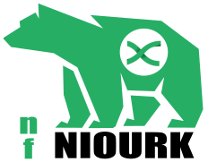

<b>NiourK is a NGS clinical workflow.</b><br/>

## Usage
```markdown
The typical command for running the pipeline is as follows:

  nextflow run niourk.nf --pathBam bamfolder --pathOut results --genome GRCh37 [arguments]

  Mandatory arguments:
    --path_bam                  Path to input BAMs folder
    --path_out                  Path to results folder
    --genome                    Reference Genome (GRCh37, GRCh38, rCRS, ...)
    --mito                      Mitochondrial mode (true|false)

  Sequencing arguments:
    --wgs                       Whole Genome Mode
    --path_bed                  Path to target BED file
    --path_genes                Path to genes list file (one gene per line)
    --platform                  Sequencing platform (iontorrent|illumina)

  Tools arguments:
    --path_elprep               Path to elPrep executable
    --path_elprep_files         Path to elPrep required files (elsites)
    --path_gatk                 Path to Genome Analysis Toolkit (GATK) executable
    --path_tvc                  Path to Torrent Variant Caller (TVC) executable
    --path_strelka              Path to Strelka executable
    --path_samtools             Path to samtools executable
    --path_mosdepth             Path to mosdepth executable
    --path_vt                   Path to vt executable
    --path_vep                  Path to VEP source directory
    --path_vep_cache            Path to VEP cache directory
    --path_vep_plugin_files     Path to VEP plugins files
    --path_vcfanno              Path to VcfAnno executable
    --path_vcfvalidator         Path to EBIvariation vcf-validator
    --version_deepvariant       Version tag for deepvariant docker container

  Depth arguments:
    --padding                   Padding size to consider

  Calling arguments:
    --min_baseq                 Minimum base quality to consider a call
    --min_mapq                  Minimum mapping quality to consider a call
    --min_cov                   Minimum coverage to consider a call
    --min_af                    Minimum variant allele frequency
    --max_sb                    Maximum variant strand-bias
    --min_varcov                Mininimum variant coverage
    --min_varscore              Minimum variant score

  Other options:
    --help                      Print help
    --monochrome                Disable ansi colors
```